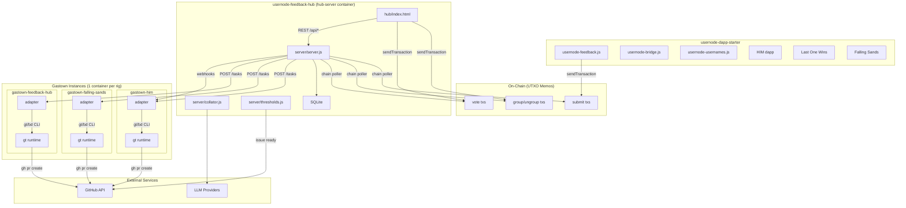

# Feedback Hub — Full Implementation Plan

## Current State

- `**usernode-feedback-hub**`: Clone of dapp-starter with `FEEDBACK_HUB_SPEC.md` added. No hub-specific code exists yet. Has the full dapp-starter infrastructure (bridge, usernames, server, examples, Docker, deploy workflow).
- `**usernode-dapp-starter**`: Production repo with bridge, usernames, server, and example dapps (HIM, Last One Wins, Falling Sands). No widget yet.

## Repo Boundary

Per the spec, the **widget** (`usernode-feedback.js`) lives in `usernode-dapp-starter` alongside the bridge and usernames module. The **Hub dapp, Hub Server, and Gastown instance containers** live in `usernode-feedback-hub`. They communicate only through on-chain transactions (widget writes, hub reads).

---

## Phase 1: Widget + On-Chain Feedback

### 1A — Feedback Widget (in `usernode-dapp-starter`)

Build `usernode-feedback.js` — a self-contained script that adds a floating feedback button to any dapp.

**Key decisions:**

- Shadow DOM for CSS isolation (avoids conflicts with host dapp styles)
- Auto-detects `target_app` from `data-app` attribute, then `location.pathname`, then `"unknown"`
- Configurable via `data-hub-url` and `data-hub-api` attributes on the script tag
- Uses the bridge's `sendTransaction` to submit feedback on-chain (no server dependency)
- Progress bar during submission (same pattern as HIM/Last One Wins)

**Files to create/modify:**

- Create `usernode-feedback.js` at repo root — floating button + form, Shadow DOM, memo format `{ app: "feedback", type: "submit", target_app, category, text }`
- Modify `server.js` — add serving route for `/usernode-feedback.js` (same pattern as bridge/usernames: `no-store` cache header)
- Modify `examples/server.js` — same serving route
- Modify each dapp HTML to include: `<script src="/usernode-feedback.js" data-app="him"></script>` (and equivalent for lastwin, falling-sands, starter)

**Memo schema:**

```json
{ "app": "feedback", "type": "submit", "target_app": "him", "category": "bug", "text": "..." }
```

Categories: `bug`, `feature`, `improvement`, `other`. Max text ~900 chars (JSON overhead ~75 chars within 1024 limit).

### 1B — Minimal Hub Dapp + Server (in `usernode-feedback-hub`)

A minimal version that reads raw feedback from the chain and displays it. No AI, no voting yet.

**Generate a unique keypair:**

```bash
node scripts/generate-keypair.js --env
```

This `APP_PUBKEY` becomes `HUB_PUBKEY` — the shared address for all feedback/vote transactions. The widget in dapp-starter needs this same value.

**Files to create:**

- `hub/index.html` — single-file dapp (follows HIM pattern: IIFE, dark/light theme, mobile-first layout, hash routing)
  - Screens: **Feed** (all feedback, filterable by app/category), **My Feedback** (user's submissions)
  - Includes bridge + usernames scripts
  - Polls `getTransactions({ account: HUB_PUBKEY })` every 4 seconds
  - Rebuilds state by parsing `submit` memos, sorting by timestamp
  - Rate-limit enforcement on read: max 5 per sender per 24h rolling window
  - Displays feedback items with username, app badge, category badge, timestamp
- `server/server.js` — Node.js server that:
  - Serves `hub/index.html` at `/` (or `/feedback`)
  - Serves bridge + usernames scripts
  - Includes explorer proxy (`/explorer-api/`* via `handleExplorerProxy` from `lib/dapp-server.js`)
  - Includes mock API (`/__mock/*` via `createMockApi` when `--local-dev`)
  - Runs a chain poller (`createChainPoller`) to index feedback transactions into memory (for Phase 2's API)
  - Exposes `GET /api/feedback` — returns indexed feedback (simple JSON, no DB yet)
- Copy `lib/dapp-server.js` from examples (shared server utilities)
- Update `Dockerfile` and `docker-compose.yml` for the hub server

**Cleanup:** Remove the example dapps (`examples/him`, `examples/last-one-wins`, `examples/falling-sands`, `examples/server.js`) from the feedback-hub repo — they belong in dapp-starter. Keep `lib/dapp-server.js`.

---

## Phase 2: AI Collation + User Grouping + Voting

### 2A — SQLite Persistence

- Create `server/db.js` — SQLite via `better-sqlite3`
  - Tables: `issues` (id, title, summary, target_app, category, priority, status, created_at, github_issue_number, github_issue_url, pr_url), `feedback_items` (tx_hash, sender, target_app, category, text, timestamp, issue_id nullable, status: submit/suggested/grouped), `votes` (tx_hash, sender, issue_id, value, timestamp), `active_participants` (app, address, last_seen, cached_at)
  - The chain poller writes to this DB; the API reads from it

### 2B — AI Collation

- Create `server/collator.js` — AI grouping suggestions
  - Runs every 5 minutes (or on new feedback)
  - Fetches ungrouped feedback from DB
  - Calls LLM (via `LLM_API_KEY`) to compare against existing issues
  - Creates new suggested issues or matches to existing ones
  - Stores suggestions in DB (not on-chain — these are AI suggestions)
- Create `server/prioritizer.js` — AI priority scoring (1-5)
  - Called by collator after grouping
  - Based on frequency, severity, recency, user impact

### 2C — Hub Dapp: Grouping + Voting UI

Expand `hub/index.html` with new screens and transaction types:

**New screens:**

- **Issue List** — filterable by app/category/status, sortable by votes/priority/recency. Each card shows: title, app badge, category badge, report count, priority stars, vote bar, quorum progress, pipeline status
- **Issue Detail** — AI-generated title/summary, confirmed feedback list, pending suggestions (accept/reject for submitters), vote bar with yes/no + quorum, your vote, pipeline status timeline
- **My Feedback** — badge for ungrouped count, AI suggestions with accept/ignore CTAs

**New on-chain transaction types:**

- `group`: `{ app: "feedback", type: "group", feedback_tx: "<hash>", issue: "<id>" }`
- `ungroup`: `{ app: "feedback", type: "ungroup", feedback_tx: "<hash>" }`
- `vote`: `{ app: "feedback", type: "vote", issue: "<id>", value: "yes"|"no" }`

**State derivation:**

- Chain poller picks up `group`, `ungroup`, `vote` transactions
- `group`/`ungroup` verified on read: sender must match original `feedback_tx` sender
- Votes: latest per user per issue wins
- Issue enters "voting" when it has >= 1 confirmed grouping

### 2D — Voting Thresholds + Auto-Promotion

- Create `server/thresholds.js` — vote counting and promotion logic
  - **Quorum**: unique voters > 1/3 of active participants for target app
  - **Approval**: > 2/3 of votes are "yes"
  - **Standard promotion**: at passing threshold for 3 consecutive days
  - **Immediate promotion**: > 2/3 of total app users voting with > 2/3 yes
  - **Auto-archive**: only 1 user activity for 3 days
  - Active participant cache: refreshed hourly from explorer API
- Server scheduler runs threshold checks periodically (every hour or on new votes)

### 2E — Hub Server REST API

Expand `server/server.js` with the full API surface:

- `GET /api/issues` — list with filters/sort
- `GET /api/issues/:id` — detail with feedback, suggestions, votes, status
- `GET /api/issues/:id/suggestions` — ungrouped feedback AI thinks belongs here
- `GET /api/feedback/ungrouped?address=...` — user's ungrouped feedback with AI matches
- `GET /api/stats` — aggregate stats (active participants, issue counts, throughput)
- `GET /api/apps` — known apps with participant counts

---

## Phase 3a: Gastown Infrastructure

### Gastown Instance Container

- Create `gastown/Dockerfile` — single image used by all rig instances: Node.js + Go + gt + bd + tmux + gh + agent CLIs
- Create `gastown/start.js` — entrypoint: first-boot setup (`gt install`, `gt rig add $RIG_NAME $REPO_URL`, agent preset config from env vars), then starts adapter HTTP server on port 3001
- Create `gastown/adapter.js` — Express API:
  - `POST /api/tasks` — accept task spec from Hub Server, translate to `bd create` + `gt convoy create` + `gt sling`
  - `GET /api/tasks/:id` — task status (polls `gt convoy list --json`)
  - `POST /api/tasks/:id/cancel` — cancel running task
- Create `gastown/gastown-bridge.js` — wraps `gt`/`bd` CLI calls with `--json`/`--stdin` via `child_process.execSync`
- Create `gastown/status-poller.js` — `setInterval` (30s) polling convoy/bead status, POSTs updates to Hub Server at `$HUB_SERVER_URL`
- Create `gastown/webhook-handler.js` — receives GitHub webhooks forwarded by Hub Server, relays `@mayor` commands via `gt mail --stdin`
- Create `gastown/github-app.js` — GitHub App auth via `@octokit/auth-app`, installation token generation
- Create `gastown/commands.js` — `@mayor` command parser (revise, retry, explain, scope, abort)

### Compose Generation

- Create `scripts/generate-compose.js` — reads `config.json`, emits `docker-compose.yml` with:
  - `hub-server` service (static)
  - One `gastown-<rig>` service per app entry, parameterized by env vars (`RIG_NAME`, `REPO_URL`, `REPO_PATH`, `MAYOR_MODEL`, `WORKER_AGENT`, `MAX_POLECATS`, `MAX_BUDGET_USD`, `HUB_SERVER_URL`)
  - Named volumes: `hub-data` + one per rig
  - Port mapping: 3101, 3102, ... for each instance (internal port always 3001)
- Create `config.json` — top-level `settings` (voting thresholds, collation interval, polling intervals) + `apps` map (per-app identity, repo targeting, Gastown config)

### GitHub App + Repo Context

- Set up GitHub App (permissions: Contents, PRs, Issues R/W; Metadata, Checks R)
- Create `CLAUDE.md` / repo context files in each target repo

### Hub Server Integration

- Wire `server/server.js` to POST task specs to per-rig Gastown instances (`http://gastown-<rig>:3001`) when issues reach "ready" status
- Hub Server routes incoming GitHub webhooks to the appropriate instance based on repo in payload
- Add `GET /api/issues/:id/spec` — AI-generated task spec endpoint

---

## Phase 3b: PR Pipeline + Feedback Loop

### GitHub Issue Mirroring

- Hub Server creates GitHub Issues when issues reach "ready" (title, summary, vote results, labels)
- Store GitHub Issue number/URL in DB

### PR Creation Flow

- Polecats create PRs via `gh pr create` with `Fixes #N`, labels `ai-generated` + app name
- Instance adapter detects convoy completion via status polling, reports PR URL to Hub Server

### Review Feedback Loop

- Hub Server receives GitHub webhooks, routes to appropriate Gastown instance by repo
- Instance webhook handler in `gastown/webhook-handler.js`:
  - `issue_comment` — detect `@mayor` commands, relay via `gt mail --stdin` to Mayor/polecat
  - `pull_request` — detect merges, report to Hub Server
  - `pull_request_review` — detect "changes requested"
  - `issues` — detect manual close/reopen of mirrored issues
- Mayor/polecat receives mail, processes instruction, pushes new commits

### Failure Handling

- Gastown Deacon detects stuck agents; GUPP handles crash recovery via bead persistence
- Instance adapter detects stalled convoys, creates PR with `needs-help` label + explanation
- Track stalled convoy count per issue; after 3 failures, move to "manual" status
- Hub dapp shows "needs-help" and "manual" states with explanation

---

## Phase 3c: Agent Polish + Cost Management

- Test Mayor-driven task decomposition on larger feature requests
- Tune worker agent selection per rig (benchmark GLM-5 vs Kimi vs Sonnet on target codebases)
- Cost tracking: monitor Gastown's token metrics dashboard, enforce `maxBudgetUsd` per convoy via adapter
- Test Refinery merge quality on parallel polecat output
- Gastown Deacon patrol tuning (stuck agent detection thresholds)
- Add convoy-level metrics to Hub's stats dashboard (success rate, cost-per-PR, time-to-merge)

---

## Phase 4: Polish + Scale

### In `usernode-dapp-starter`:

- Screenshot support in widget (image upload, IPFS/blob storage, reference in memo)
- Notification badges in widget (dot indicator for ungrouped feedback via `data-hub-api`)

### In `usernode-feedback-hub`:

- Stats/Leaderboard screen: top contributors, pipeline throughput, per-app breakdown
- Mayor performance dashboard: success rate, avg time ready-to-merged, cost metrics
- Multi-repo issue support (issues spanning multiple repos)
- Evaluate community-governed merges (auto-merge after community vote on PR)

---

## Architecture Diagram




## Key Technical Decisions

- **Hub dapp is a single HTML file** following the same pattern as HIM (IIFE, inline CSS/JS, bridge + usernames, hash routing, dark/light theme, tx progress bar)
- **Hub Server and Hub dapp are co-deployed** on the same origin (relative API paths like `/api/issues`)
- **Chain poller is the source of truth bridge** — all on-chain data (feedback, groups, votes) flows through the poller into SQLite; the REST API reads from SQLite
- **AI suggestions are off-chain** (stored in SQLite); user confirmations are on-chain (`group`/`ungroup` txs)
- **Gastown for agent orchestration** — task decomposition (Mayor), merge queue (Refinery), worker monitoring (Witness + Deacon), crash recovery (GUPP + Beads) all built-in; thin per-instance Node.js adapter wraps CLI
- **One container per rig** — `docker-compose.yml` generated from `config.json` by `scripts/generate-compose.js`; each rig is independently restartable and resource-limitable; natural unit for future decentralization
- **Split Mayor/worker models** — expensive model (Opus) for Mayor coordination, cheap models (GLM-5, Kimi) for polecats; ~$10-20 per convoy vs ~$100 all-Opus
- **Git worktrees for isolation** — lighter than Docker containers, naturally integrates with Git-based PR workflows
- **GitHub App for auth** — short-lived installation tokens, bot identity, webhook support

## Dependencies to Add

- **`usernode-feedback-hub`**: `better-sqlite3`, `@octokit/rest`, `@octokit/auth-app`, `@octokit/webhooks`, `express` (or keep raw http like server.js). Gastown + Beads installed via their own CLIs (not npm).
- **`usernode-dapp-starter`**: No new dependencies (widget is zero-dependency like the bridge)

